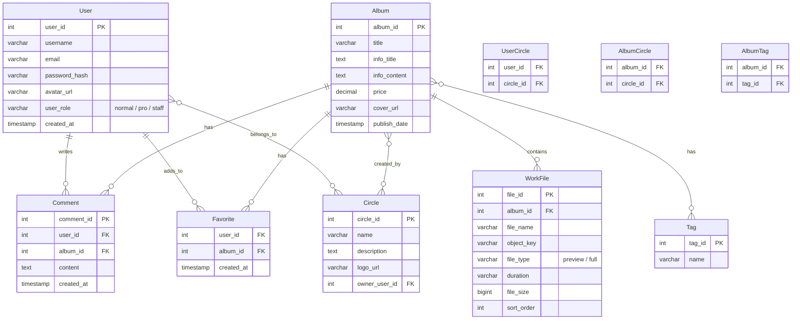

# ER图



# DDL

```sql
-- 用户表
CREATE TABLE users (
    user_id SERIAL PRIMARY KEY,
    username VARCHAR(50) UNIQUE NOT NULL,
    email VARCHAR(100) UNIQUE,
    password_hash VARCHAR(255),
    avatar_url VARCHAR(500),
    user_role VARCHAR(10) DEFAULT 'normal' CHECK (user_role IN ('normal', 'pro', 'staff')),
    created_at TIMESTAMP DEFAULT NOW()
);

-- 社团表
CREATE TABLE circles (
    circle_id SERIAL PRIMARY KEY,
    name VARCHAR(100) NOT NULL,
    description TEXT,
    logo_url VARCHAR(500),
    owner_user_id INT REFERENCES users(user_id) ON DELETE SET NULL
);

-- 用户-社团关联表
CREATE TABLE user_circles (
    user_id INT REFERENCES users(user_id) ON DELETE CASCADE,
    circle_id INT REFERENCES circles(circle_id) ON DELETE CASCADE,
    PRIMARY KEY (user_id, circle_id)
);

-- 专辑表
CREATE TABLE albums (
    album_id SERIAL PRIMARY KEY,
    title VARCHAR(200) NOT NULL,
    info_title TEXT,
    info_content TEXT,
    price DECIMAL(10,2) DEFAULT 0,
    cover_url VARCHAR(500),
    publish_date TIMESTAMP DEFAULT NOW()
);

-- 专辑-社团关联表（多对多，完全平等）
CREATE TABLE album_circles (
    album_id INT REFERENCES albums(album_id) ON DELETE CASCADE,
    circle_id INT REFERENCES circles(circle_id) ON DELETE CASCADE,
    PRIMARY KEY (album_id, circle_id)
);

-- 专辑文件表（音频）
CREATE TABLE work_files (
    file_id SERIAL PRIMARY KEY,
    album_id INT REFERENCES albums(album_id) ON DELETE CASCADE,
    file_name VARCHAR(200) NOT NULL,
    object_key VARCHAR(500),
    file_type VARCHAR(10) NOT NULL CHECK (file_type IN ('preview', 'full')),
    duration VARCHAR(10),
    file_size BIGINT DEFAULT 0,
    sort_order INT DEFAULT 0
);

-- 标签表
CREATE TABLE tags (
    tag_id SERIAL PRIMARY KEY,
    name VARCHAR(50) UNIQUE NOT NULL
);

-- 专辑-标签关联表
CREATE TABLE album_tags (
    album_id INT REFERENCES albums(album_id) ON DELETE CASCADE,
    tag_id INT REFERENCES tags(tag_id) ON DELETE CASCADE,
    PRIMARY KEY (album_id, tag_id)
);

-- 评论表
CREATE TABLE comments (
    comment_id SERIAL PRIMARY KEY,
    user_id INT REFERENCES users(user_id) ON DELETE SET NULL,
    album_id INT REFERENCES albums(album_id) ON DELETE CASCADE,
    content TEXT NOT NULL,
    created_at TIMESTAMP DEFAULT NOW()
);

-- 收藏表
CREATE TABLE favorites (
    user_id INT REFERENCES users(user_id) ON DELETE CASCADE,
    album_id INT REFERENCES albums(album_id) ON DELETE CASCADE,
    created_at TIMESTAMP DEFAULT NOW(),
    PRIMARY KEY (user_id, album_id)
);

-- 索引
CREATE INDEX idx_work_files_album_id ON work_files(album_id);
CREATE INDEX idx_work_files_file_type ON work_files(file_type);
CREATE INDEX idx_comments_album_id ON comments(album_id);
CREATE INDEX idx_favorites_user_id ON favorites(user_id);
CREATE INDEX idx_albums_publish_date ON albums(publish_date);
```