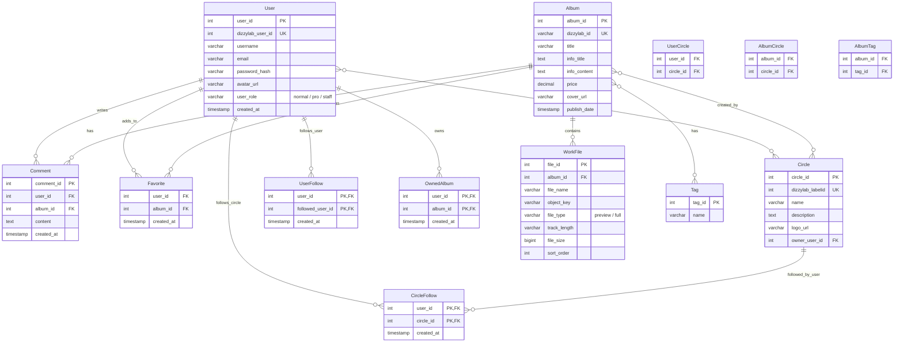

# ER图

```mermaid
erDiagram
    User ||--o{ Comment : writes
    User ||--o{ Favorite : adds_to
    User }o--o{ Circle : belongs_to
    User ||--o{ UserFollow : follows_user
    User ||--o{ CircleFollow : follows_circle
    User ||--o{ OwnedAlbum : owns

    Album ||--o{ WorkFile : contains
    Album ||--o{ Comment : has
    Album ||--o{ Favorite : has
    Album }o--o{ Tag : has
    Album }o--o{ Circle : created_by

    Circle ||--o{ CircleFollow : followed_by_user

    User {
        int user_id PK
        int dizzylab_user_id UK
        varchar username
        varchar email
        varchar password_hash
        varchar avatar_url
        varchar user_role "normal / pro / staff"
        timestamp created_at
    }

    Circle {
        int circle_id PK
        int dizzylab_labelid UK
        varchar name
        text description
        varchar logo_url
        int owner_user_id FK
    }

    UserCircle {
        int user_id FK
        int circle_id FK
    }

    Album {
        int album_id PK
        varchar dizzylab_id UK
        varchar title
        text info_title
        text info_content
        decimal price
        varchar cover_url
        timestamp publish_date
    }

    AlbumCircle {
        int album_id FK
        int circle_id FK
    }

    WorkFile {
        int file_id PK
        int album_id FK
        varchar file_name
        varchar object_key
        varchar file_type "preview / full"
        varchar track_length
        bigint file_size
        int sort_order
    }

    Tag {
        int tag_id PK
        varchar name
    }

    AlbumTag {
        int album_id FK
        int tag_id FK
    }

    Comment {
        int comment_id PK
        int user_id FK
        int album_id FK
        text content
        timestamp created_at
    }

    Favorite {
        int user_id FK
        int album_id FK
        timestamp created_at
    }

    UserFollow {
        int user_id PK, FK
        int followed_user_id PK, FK
        timestamp created_at
    }

    CircleFollow {
        int user_id PK, FK
        int circle_id PK, FK
        timestamp created_at
    }

    OwnedAlbum {
        int user_id PK, FK
        int album_id PK, FK
        timestamp created_at
    }
```

# DDL

见 [`database/create_database.sql`](../database/create_database.sql)（完整 14 张表 + 14 条索引）。
