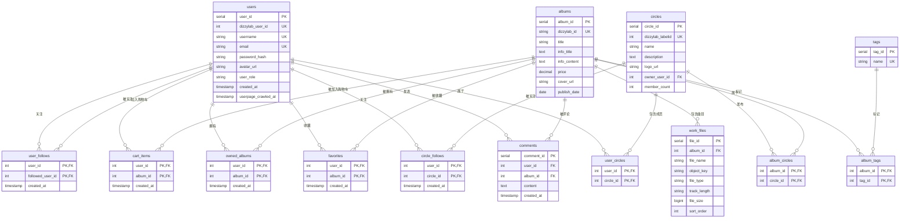

# IndieTracks 数据库 ER 图与 DDL

> 更新：2026-06-09
> PostgreSQL 18，14 张表

---

## ER 关系图

```mermaid
erDiagram
    users {
        serial user_id PK
        int dizzylab_user_id UK
        string username UK
        string email UK
        string password_hash
        string avatar_url
        string user_role
        timestamp created_at
        timestamp userpage_crawled_at
    }

    circles {
        serial circle_id PK
        int dizzylab_labelid UK
        string name
        text description
        string logo_url
        int owner_user_id FK
        int member_count
    }

    albums {
        serial album_id PK
        string dizzylab_id UK
        string title
        text info_title
        text info_content
        decimal price
        string cover_url
        date publish_date
    }

    tags {
        serial tag_id PK
        string name UK
    }

    work_files {
        serial file_id PK
        int album_id FK
        string file_name
        string object_key
        string file_type
        string track_length
        bigint file_size
        int sort_order
    }

    comments {
        serial comment_id PK
        int user_id FK
        int album_id FK
        text content
        timestamp created_at
    }

    user_circles {
        int user_id PK,FK
        int circle_id PK,FK
    }

    album_circles {
        int album_id PK,FK
        int circle_id PK,FK
    }

    album_tags {
        int album_id PK,FK
        int tag_id PK,FK
    }

    favorites {
        int user_id PK,FK
        int album_id PK,FK
        timestamp created_at
    }

    owned_albums {
        int user_id PK,FK
        int album_id PK,FK
        timestamp created_at
    }

    cart_items {
        int user_id PK,FK
        int album_id PK,FK
        timestamp created_at
    }

    circle_follows {
        int user_id PK,FK
        int circle_id PK,FK
        timestamp created_at
    }

    user_follows {
        int user_id PK,FK
        int followed_user_id PK,FK
        timestamp created_at
    }

    users ||--o{ comments : "发表"
    users ||--o{ favorites : "收藏"
    users ||--o{ owned_albums : "拥有"
    users ||--o{ cart_items : "加入购物车"
    users ||--o{ user_circles : "属于"
    users ||--o{ circle_follows : "关注"
    users ||--o{ user_follows : "关注"
    users ||--o{ user_follows : "被关注"

    circles ||--o{ user_circles : "包含成员"
    circles ||--o{ album_circles : "发布"
    circles ||--o{ circle_follows : "被关注"

    albums ||--o{ work_files : "包含曲目"
    albums ||--o{ album_circles : "属于"
    albums ||--o{ album_tags : "标记"
    albums ||--o{ comments : "被评论"
    albums ||--o{ favorites : "被收藏"
    albums ||--o{ owned_albums : "被拥有"
    albums ||--o{ cart_items : "被加入购物车"

    tags ||--o{ album_tags : "标记"
```

---

## 核心实体（4 张）

| 表 | 主键 | 去重键 | 说明 |
|:---|:---|:---|:---|
| `users` | `user_id` SERIAL | `dizzylab_user_id` UNIQUE | role: normal/pro/staff, `userpage_crawled_at` |
| `circles` | `circle_id` SERIAL | `dizzylab_labelid` UNIQUE | `member_count` 记录上次爬取成员数 |
| `albums` | `album_id` SERIAL | `dizzylab_id` UNIQUE | `info_title`/`info_content` 替代 description |
| `tags` | `tag_id` SERIAL | `name` UNIQUE | 标签（已去 `#`） |

## 关联表（7 张）

| 表 | 主键 | 说明 |
|:---|:---|:---|
| `user_circles` | (user_id, circle_id) | 社团成员 |
| `album_circles` | (album_id, circle_id) | 专辑-社团（多对多） |
| `album_tags` | (album_id, tag_id) | 专辑-标签（多对多） |
| `owned_albums` | (user_id, album_id) | 已购 |
| `favorites` | (user_id, album_id) | 收藏 |
| `cart_items` | (user_id, album_id) | 购物车（临时关联，结算后清空） |
| `circle_follows` | (user_id, circle_id) | 关注社团 |

## 数据表（3 张）

| 表 | 外键 | 说明 |
|:---|:---|:---|
| `work_files` | `album_id → albums` | 曲目，`file_type`: preview/full，`object_key` 存 MinIO 路径 |
| `comments` | `user_id → users` SET NULL, `album_id → albums` CASCADE | 评论 |
| `user_follows` | `user_id → users`, `followed_user_id → users` | 用户关注 |

## 索引（16 条）

- `albums(dizzylab_id)` UNIQUE
- `users(dizzylab_user_id)` UNIQUE
- `circles(dizzylab_labelid)` UNIQUE
- `work_files(album_id)`, `work_files(file_type)`
- `comments(album_id)`
- `favorites(user_id)`
- `albums(publish_date)`
- `owned_albums(user_id)`, `owned_albums(album_id)`
- `cart_items(user_id)`, `cart_items(album_id)`
- `circle_follows(user_id)`, `circle_follows(circle_id)`
- `user_follows(user_id)`, `user_follows(followed_user_id)`

## 迁移（幂等）

| 迁移 | 表 | 列 | 用途 |
|:---|:---|:---|:---|
| userpage_crawled_at | users | TIMESTAMP | user_pages 爬取追踪 |
| member_count | circles | INTEGER DEFAULT 0 | circle_members 成员数追踪 |

---

文件位置：`database/create_database.sql`
