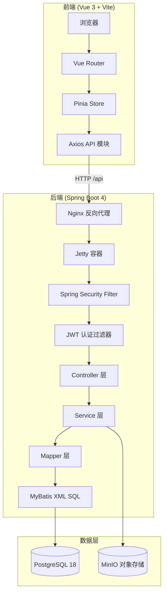
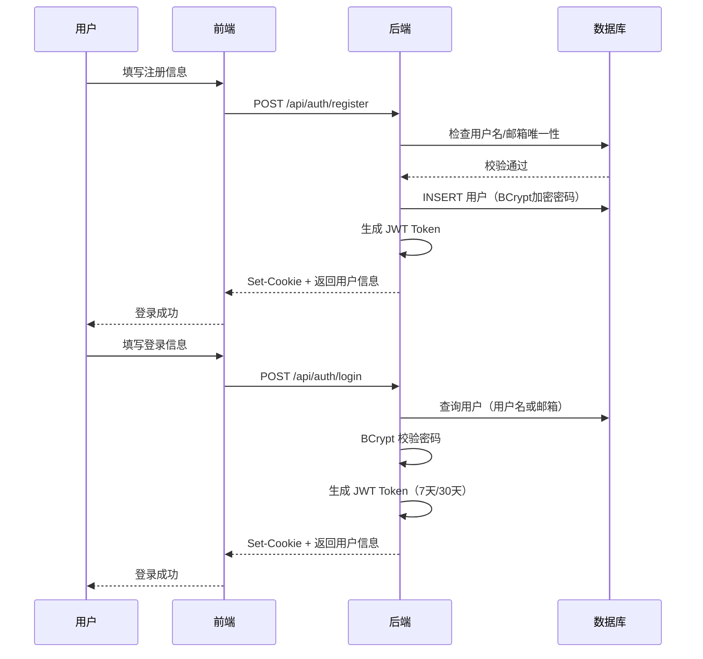
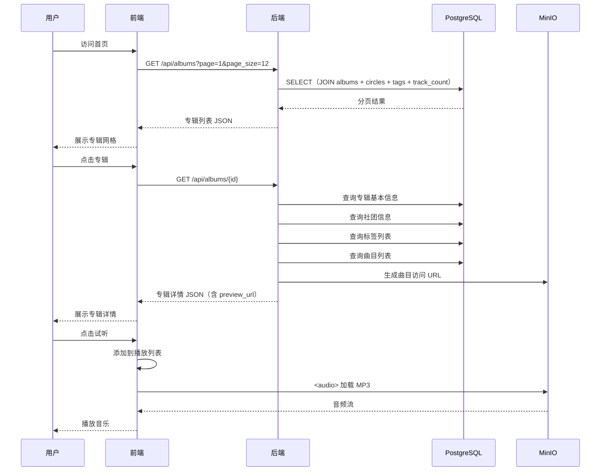
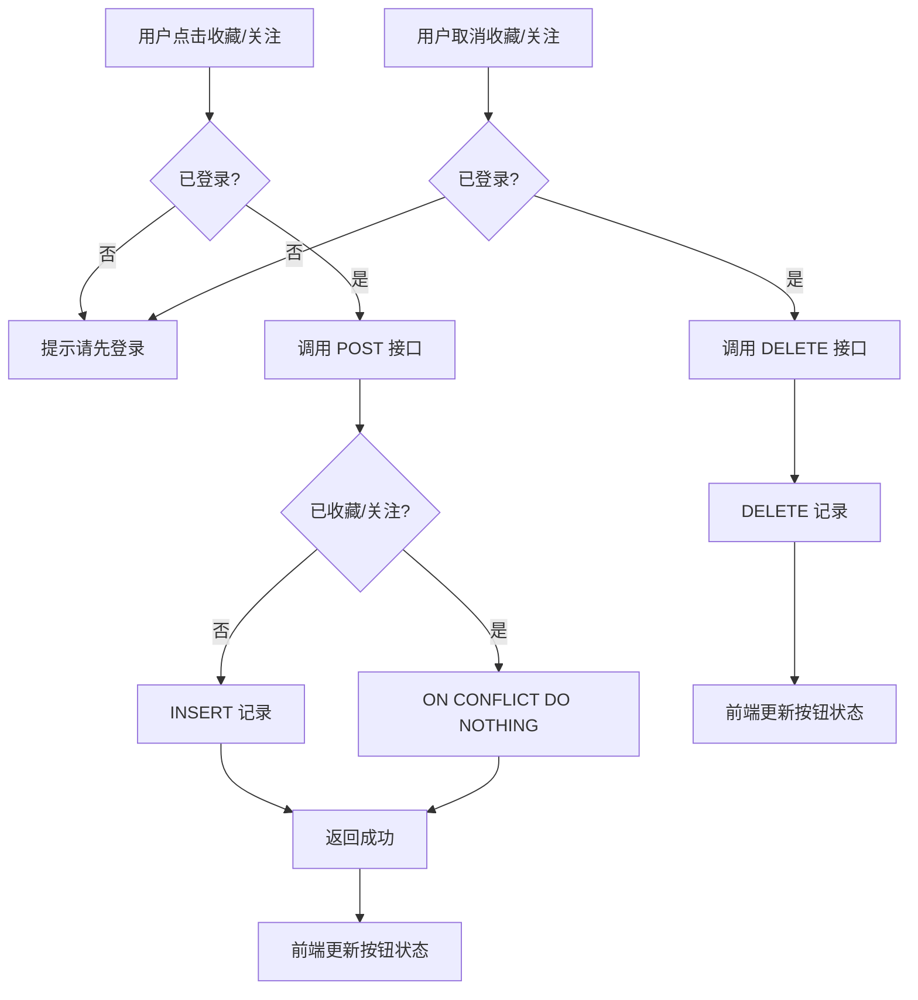
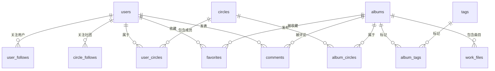

# 轻量级框架应用开发

> 课设题目：IndieTracks 独立音乐展示平台的设计与实现

---

## 一、系统设计

### 1.1 系统概述

IndieTracks 是一个独立音乐作品展示与试听平台，参考 dizzylab.net 设计。系统采用前后端分离的 B/S 架构，后端基于 Spring Boot 4 + MyBatis-Plus 构建 RESTful API，前端使用 Vue 3 + Vite 构建单页应用，数据层使用 PostgreSQL 18 关系型数据库存储结构化数据，MinIO 对象存储管理音频文件和图片资源。

系统支持专辑浏览、在线试听、社团展示、用户收藏、关注、评论等核心功能。

### 1.2 技术选型

| 层次 | 技术 | 选型理由 |
|:---|:---|:---|
| 后端框架 | Spring Boot 4.0.6 | 课程要求的轻量级框架，自动配置、内嵌服务器 |
| 持久层 | MyBatis-Plus 3.5.15 | 课程要求，支持 XML 自定义 SQL、分页插件 |
| 数据库 | PostgreSQL 18 | 支持 JSON、数组类型，LATERAL 子查询 |
| 对象存储 | MinIO | 本地部署，S3 兼容，支持匿名访问 |
| 安全框架 | Spring Security + JWT | Cookie 传递 Token，BCrypt 密码加密 |
| 前端框架 | Vue 3 + Vite 8 | 组合式 API，快速构建 SPA |
| 前端状态 | Pinia | 轻量级状态管理，支持 localStorage 持久化 |
| Web 容器 | Jetty | 低内存占用，适合 2GB 服务器部署 |

### 1.3 系统架构设计

系统采用经典的三层架构：Controller（接口层）→ Service（业务层）→ Mapper（持久层）。



### 1.4 业务流程设计

#### 1.4.1 用户注册登录流程

用户通过注册页面填写用户名、邮箱、密码完成注册。注册时后端校验用户名和邮箱的唯一性，密码使用 BCrypt 加密存储。登录时支持用户名或邮箱登录，登录成功后后端生成 JWT Token 并通过 HttpOnly Cookie 返回给前端。前端将用户信息存储在 Pinia Store 中，页面刷新时通过 `/api/auth/me` 接口恢复登录状态。



#### 1.4.2 专辑浏览与试听流程

用户访问首页时，前端请求专辑列表接口，后端通过 MyBatis XML 手写 JOIN 查询一次性返回专辑信息、社团名称、标签列表和曲目数量。点击专辑进入详情页，后端分别查询专辑基本信息、社团信息、标签列表、曲目列表和评论列表，为每条曲目生成 MinIO 访问 URL。用户点击试听按钮，前端将曲目添加到播放列表，通过 `<audio>` 元素播放 MinIO 中的音频文件。



#### 1.4.3 收藏与关注流程

登录用户可以收藏专辑、关注社团和关注用户。前端在操作前检查登录状态，调用后端接口时 JWT Cookie 自动携带。后端通过 Spring Security Filter 链验证 Token 有效性，未登录返回 401。收藏/关注操作使用数据库联合主键保证幂等性（`ON CONFLICT DO NOTHING`）。



#### 1.4.4 评论 CRUD 流程

登录用户可以在专辑详情页发表评论。评论支持发表、编辑、删除完整 CRUD。编辑和删除操作需要校验评论所有权（只能操作自己的评论）。评论列表支持滚动到底部自动加载下一页（无限滚动）。

### 1.5 数据库设计

数据库采用 PostgreSQL 18，共 14 张表。核心实体包括用户（users）、社团（circles）、专辑（albums）、标签（tags），通过关联表实现多对多关系。



### 1.6 接口设计

系统提供 RESTful API，所有接口以 `/api` 为前缀。公开接口（专辑、社团、标签浏览）无需登录，用户操作接口（收藏、关注、评论）需要 JWT 认证。

| 接口 | 方法 | 说明 | 鉴权 |
|:---|:---|:---|:---|
| `/api/albums` | GET | 专辑列表（分页+筛选+排序） | 无 |
| `/api/albums/{id}` | GET | 专辑详情（含社团、标签、曲目、评论） | 无 |
| `/api/albums/{id}/comments` | GET/POST | 评论列表/发表评论 | POST 需登录 |
| `/api/circles` | GET | 社团列表（含代表标签、预览专辑） | 无 |
| `/api/circles/{id}` | GET | 社团详情 | 无 |
| `/api/tags` | GET | 标签列表 | 无 |
| `/api/users/{id}` | GET | 用户信息 | 无 |
| `/api/users/{id}/favorites` | GET | 用户收藏列表 | 无 |
| `/api/auth/register` | POST | 用户注册 | 无 |
| `/api/auth/login` | POST | 用户登录 | 无 |
| `/api/auth/logout` | POST | 用户登出 | 需登录 |
| `/api/auth/me` | GET | 获取当前用户 | 需登录 |
| `/api/auth/avatar` | POST | 上传头像 | 需登录 |
| `/api/favorites/{albumId}` | POST/DELETE | 收藏/取消收藏 | 需登录 |
| `/api/circle-follows/{id}` | POST/DELETE | 关注/取消关注社团 | 需登录 |
| `/api/user-follows/{id}` | POST/DELETE | 关注/取消关注用户 | 需登录 |
| `/api/comments/{id}` | PUT/DELETE | 编辑/删除评论 | 需登录（仅自己的） |

### 1.7 设计重难点

**难点一：MyBatis XML 复杂 JOIN 查询**

专辑列表接口需要一次查询返回专辑信息、社团名称、标签数组、曲目数量。使用 PostgreSQL 的 `LATERAL` 子查询和 `array_agg` 聚合函数，配合 MyBatis XML 的 `<sql>` 片段复用，实现了三个查询共享同一套 JOIN 逻辑。

**难点二：Spring Security 与 JWT 集成**

Spring Boot 4.0.6 的 MyBatis-Plus 自动配置与 Spring Security 存在兼容性问题，需要手动配置 `SqlSessionFactory`。JWT Token 通过 HttpOnly Cookie 传递，配合自定义 `JwtAuthFilter` 实现无状态认证。

**难点三：MinIO 音频文件管理**

爬虫将音频文件存储在 MinIO 中，后端根据数据库中的 `object_key` 字段动态生成访问 URL。设置 MinIO 匿名访问策略，前端 `<audio>` 元素直接加载 MinIO 地址播放。

### 1.8 系统特色

1. **三层架构规范**：Controller → Service → Mapper 严格分层，Controller 不直接操作 Mapper
2. **DTO 模式**：Entity 与 API 返回分离，敏感字段（password_hash、email）不暴露给前端
3. **统一 API 模块**：前端所有 HTTP 请求通过 `request.js` 统一管理，支持 401 拦截器
4. **PostgreSQL 特性**：利用 `LATERAL` 子查询、`array_agg` 聚合、`ON CONFLICT` 幂等插入
5. **低内存部署**：Jetty 容器 + 2GB 服务器即可运行，适合课程演示环境

---

## 二、系统实现

### 2.1 后端项目结构

后端采用标准 Spring Boot 三层架构，按功能模块组织代码：

```
com.indietracks.backend/
├── config/          # 配置类（SecurityConfig, MyBatisPlusConfig, MinioConfig, CorsConfig）
├── controller/      # 接口层（8 个 Controller）
├── service/         # 业务层（9 个 Service）
├── mapper/          # 持久层（8 个 Mapper 接口）
├── entity/          # 数据库实体（13 个，snake_case 字段）
├── dto/             # 数据传输对象（8 个 DTO）
├── filter/          # JWT 认证过滤器
├── util/            # JWT 工具类
└── handler/         # PostgreSQL 数组 TypeHandler
```

### 2.2 核心模块实现

#### 2.2.1 MyBatis-Plus 配置

由于 Spring Boot 4.0.6 与 MyBatis-Plus 3.5.15 的自动配置存在兼容性问题，手动配置 `SqlSessionFactory`，使用 `MybatisSqlSessionFactoryBean` 创建会话工厂，注册分页插件和 PostgreSQL 数组 TypeHandler。

配置要点：
- 使用 `MybatisSqlSessionFactoryBean` 替代默认的 `SqlSessionFactoryBean`
- 关闭驼峰映射（`mapUnderscoreToCamelCase=false`），保持 snake_case 全链路一致
- 注册 `PaginationInnerInterceptor` 分页插件
- 注册自定义 `StringListTypeHandler` 处理 PostgreSQL 数组类型

#### 2.2.2 Spring Security + JWT 认证

认证流程：
1. 用户登录成功后，`JwtUtil` 生成 JWT Token（包含 user_id 和 username）
2. Token 通过 `HttpOnly Cookie` 返回，前端无法通过 JavaScript 读取
3. 每次请求携带 Cookie，`JwtAuthFilter` 从 Cookie 中提取 Token 并验证
4. 验证通过后将 user_id 存入 `SecurityContext`，后续 Controller 通过 `Authentication` 获取

密码使用 BCrypt 加密存储，注册时调用 `BCryptPasswordEncoder.encode()`，登录时调用 `matches()` 校验。

#### 2.2.3 专辑列表查询

专辑列表是系统最复杂的查询，需要一次返回专辑信息、社团名称、标签数组、曲目数量。使用 MyBatis XML 手写 SQL，核心逻辑：

- 主查询 `albums` 表，LEFT JOIN `album_circles` → `circles` 获取社团信息
- LATERAL 子查询 `array_agg` 聚合标签为 PostgreSQL 数组
- LATERAL 子查询 `COUNT` 统计曲目数量
- 通过 `<sql>` 片段提取公共列定义和 JOIN 逻辑，三个查询复用
- 动态 `<where>` 支持标签筛选、搜索、价格筛选
- `<choose>` 支持多种排序方式

#### 2.2.4 MinIO 音频管理

MinIO 用于存储音频文件和图片资源。系统使用 MinIO 匿名访问策略，后端根据数据库中的 `object_key` 字段拼接完整 URL 返回给前端。音频文件由 Scrapy 爬虫从 dizzylab.net 抓取后上传到 MinIO，路径格式为 `audio/preview/{dizzylab_id}/{sort_order}.mp3`。

#### 2.2.5 社团标签聚合

社团列表和社团详情接口需要返回该社团的代表性标签（按频率取前 3 个）。在 `CircleService` 中提取了 `extractTopTags()` 私有方法，统计所有专辑标签的出现频率，排序后取前 3 个。社团列表通过批量查询（`selectAlbumsByCircleIds`）避免 N+1 问题。

### 2.3 前端实现概述

前端使用 Vue 3 组合式 API，按原子化设计组织组件：molecules → organisms → layouts → views。核心模块包括：

- **Pinia Store**：`usePlayerStore`（播放器状态）、`useUserStore`（用户认证）、`useFavoriteStore`（收藏状态）
- **API 模块**：`request.js` 封装 Axios 实例，统一管理所有 HTTP 请求，支持 401 拦截器
- **播放器**：底部固定播放条，使用 `<audio>` 元素播放 MinIO 音频，支持进度条拖拽和自动切歌

---

## 三、系统测试

### 3.1 测试环境

| 项目 | 配置 |
|:---|:---|
| 操作系统 | Windows 11 Pro |
| JDK | Amazon Corretto 25.0.3 LTS |
| PostgreSQL | 17 |
| MinIO | 最新版 |
| 浏览器 | Chrome |
| API 测试工具 | Apifox |

### 3.2 测试方法

使用 Apifox 进行接口测试。Apifox 是一款集 API 文档、API 调试、API Mock 于一体的 API 协作平台，支持自动保存请求历史和截图导出。

### 3.3 测试用例与结果

#### 3.3.1 用户注册接口测试

**接口**：`POST /api/auth/register`

**请求参数**：
```json
{
  "username": "testuser",
  "email": "test@example.com",
  "password": "123456"
}
```

**预期结果**：返回用户信息（user_id, username, user_role），密码不暴露，Cookie 中设置 JWT Token。

**测试截图**：（在 Apifox 中截图）

#### 3.3.2 用户登录接口测试

**接口**：`POST /api/auth/login`

**请求参数**：
```json
{
  "account": "testuser",
  "password": "123456",
  "remember_me": false
}
```

**预期结果**：返回用户信息，Cookie 中设置 JWT Token（7天有效期）。

#### 3.3.3 专辑列表接口测试

**接口**：`GET /api/albums?page=1&page_size=3&price=free`

**预期结果**：返回分页数据，包含 total、page、page_size、data 数组，所有专辑 price 为 0。

#### 3.3.4 专辑详情接口测试

**接口**：`GET /api/albums/8`

**预期结果**：返回专辑完整信息，包含 circle（社团信息）、tags（标签列表）、tracks（曲目列表含 preview_url）、comments（评论列表）。

#### 3.3.5 收藏专辑接口测试

**接口**：`POST /api/favorites/8`（需登录）

**预期结果**：返回 `{"message": "已收藏"}`，再次调用幂等成功。

#### 3.3.6 关注社团接口测试

**接口**：`POST /api/circle-follows/1`（需登录）

**预期结果**：返回 `{"message": "已关注"}`。

#### 3.3.7 发表评论接口测试

**接口**：`POST /api/albums/8/comments`（需登录）

**请求参数**：
```json
{
  "content": "Nice album!"
}
```

**预期结果**：返回评论列表，新评论在最前面。

#### 3.3.8 未登录访问受保护接口测试

**接口**：`POST /api/favorites/8`（不带 Cookie）

**预期结果**：返回 401 Unauthorized。

### 3.4 Apifox 截图操作指南

在 Apifox 中截图的步骤：

1. 打开 Apifox，创建新项目或打开已有项目
2. 在左侧目录树中创建接口分组（如"用户模块"、"专辑模块"）
3. 新建接口，选择请求方法（GET/POST/PUT/DELETE），输入接口地址
4. 在 Headers 中添加 `Content-Type: application/json`（POST/PUT 请求）
5. 在 Body 中输入 JSON 请求参数
6. 点击"发送"按钮，查看响应结果
7. 确认响应正确后，点击接口名称旁的"截图"图标（或使用快捷键 Ctrl+Shift+S）
8. 选择截图区域（建议包含请求 URL、请求参数、响应结果三部分）
9. 保存截图到项目目录，文档中引用截图路径

---

## 四、部署说明

### 4.1 运行环境要求

| 组件 | 最低配置 |
|:---|:---|
| 服务器 | 2 核 CPU，2GB 内存 |
| JDK | Amazon Corretto 25 LTS |
| PostgreSQL | 17+ |
| MinIO | 最新版 |
| Nginx | 1.24+ |

### 4.2 部署步骤

1. 启动 PostgreSQL，执行 `database/create_database.sql` 建表
2. 启动 MinIO，执行 `scripts/windows/setup-minio.py` 配置存储桶
3. 启动后端：`cd backend && mvn spring-boot:run`
4. 构建前端：`cd frontend && npm run build`
5. 配置 Nginx 反向代理：`/api` 转发后端，`/` 转发前端静态文件

---

*文档完*
